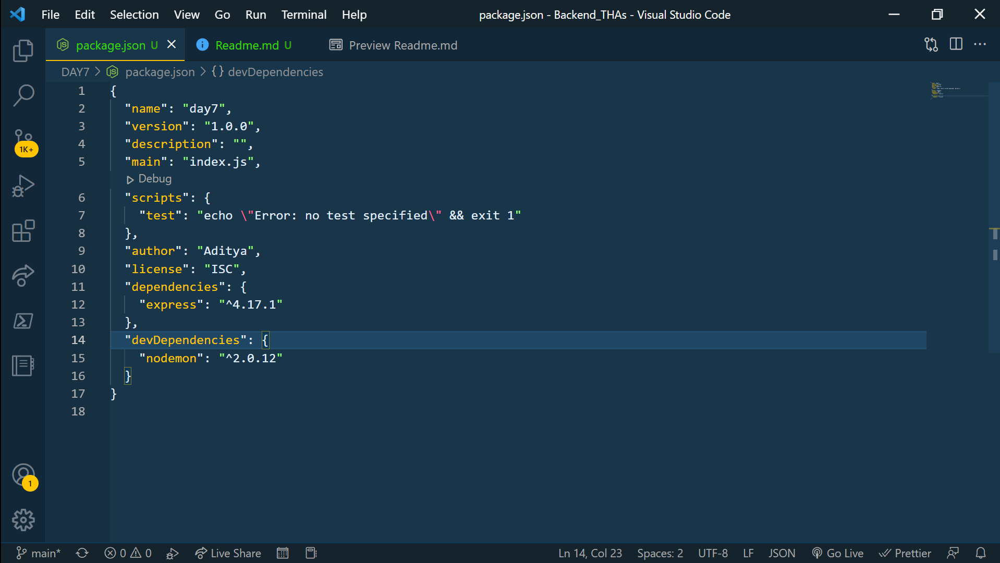

<h1>EXPRESS & IT's INSTALLATION</h1>

1. To make the npm work in a folder we have to tell that this folder will contain nodeJs files. So, we have to install the package.json packages in our file as -> npm init

2. To install express modules we have to write -> npm install --save express (this will install the node_modules files of express)

3. "version": "1.0.0"
    - 1(denotes the breaking change in the code which contain new user experience(major version)).
    - 0(denotes the minor chnages/new features in the code(minor version)).
    - 0(denotes the bug fixed in the code).

4. We run our react projects on local host during development stage. Similarly, to run the nodeJs in development stage we have to install the nodemon modules. 
    - To install nodemon module -- npm install --save-dev nodemon (This will install nodemon in node_modules folder)

5. What is the differnce between the --save & --save-dev?
    - As we know there are two stages, development & production. So, during production stage we have to make our code run fast and execute fast so the express modules get install in dependencies folder (Check it in package.json file)
    - Similarly, during the development stage we do not need fast execution so we use --save-dev and it gets installed in devDependencies (Check it in package.json)

  

6. To run nodemon  
    - nodemon index.js (nodemon will start watching index.js file and every change in that file will be visible at the server).
    - We have to make index.js file and inside it we have to use express and it functionality (refer index.js file)
    - If nodemon do not run and show error try adding it in scripts inside package.json as "server": "nodemon index.js(fileName)".

7. res.send is common as it can take array,json,string. So, to maintain specificity we use particular keyword with res. JSON is the most commonly used keyword.

8. Three basic words must be remembered in backend

    - Security
    - Performance
    - Edge Cases